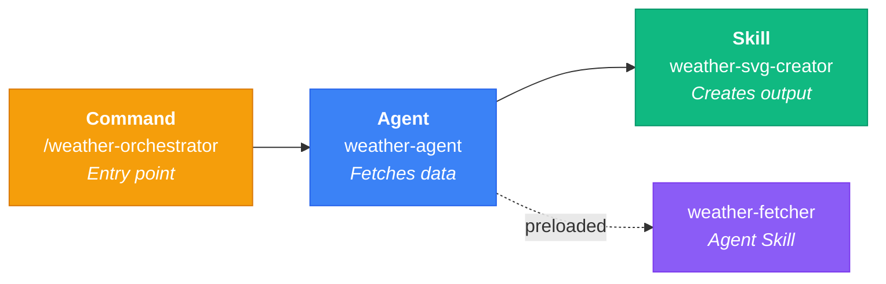

## At a Glance

<StatsGrid :stats="[
  { icon: 'tabler:file-text', value: '52', label: 'Doc Pages', color: '#D97706' },
  { icon: 'tabler:settings', value: '60+', label: 'Settings', color: '#2563eb' },
  { icon: 'tabler:terminal-2', value: '65', label: 'Commands', color: '#16a34a' },
  { icon: 'tabler:variable', value: '170+', label: 'Env Vars', color: '#9333ea' },
  { icon: 'tabler:bulb', value: '69', label: 'Tips', color: '#ea580c' },
  { icon: 'tabler:video', value: '6', label: 'Video Talks', color: '#dc2626' },
]" />

## Concepts

<ConceptTable :concepts="[
  { name: 'Subagents', icon: 'tabler:robot', description: 'Spawn specialized agents with custom tools, models, and permissions', link: '/best-practices/subagents' },
  { name: 'Commands', icon: 'tabler:terminal-2', description: 'Custom slash commands (.claude/commands/) with YAML frontmatter', link: '/best-practices/commands' },
  { name: 'Skills', icon: 'tabler:bolt', description: 'Reusable capabilities (.claude/skills/) with context files', link: '/best-practices/skills' },
  { name: 'Workflows', icon: 'tabler:git-merge', description: 'Multi-step orchestration: Command → Agent → Skill', link: '/workflows/orchestration' },
  { name: 'Hooks', icon: 'tabler:webhook', description: 'Event-driven handlers triggered by Claude Code lifecycle events', link: '/best-practices/settings' },
  { name: 'MCP Servers', icon: 'tabler:plug', description: 'Model Context Protocol integrations (Playwright, Context7, DeepWiki)', link: '/best-practices/mcp' },
  { name: 'Settings', icon: 'tabler:adjustments', description: '5-level configuration hierarchy from managed to global', link: '/best-practices/settings' },
  { name: 'Memory', icon: 'tabler:brain', description: 'Persistent context via CLAUDE.md with monorepo loading strategies', link: '/best-practices/memory' },
  { name: 'CLI Flags', icon: 'tabler:flag', description: '40+ startup flags and environment variables', link: '/best-practices/cli-startup-flags' },
  { name: 'Power-Ups', icon: 'tabler:rocket', description: 'Interactive lessons teaching Claude Code features', link: '/best-practices/power-ups' },
]" />

## Orchestration Pattern

The **Command → Agent → Skill** pattern is the recommended architecture:

| Component | Role | Example |
|-----------|------|---------|
| **Command** | Entry point, handles user interaction | `/weather-orchestrator` |
| **Agent** | Fetches data with preloaded skills | `weather-agent` + `weather-fetcher` |
| **Skill** | Creates output independently | `weather-svg-creator` |

[Learn more about the orchestration pattern →](/workflows/orchestration)

<SponsorCard />
